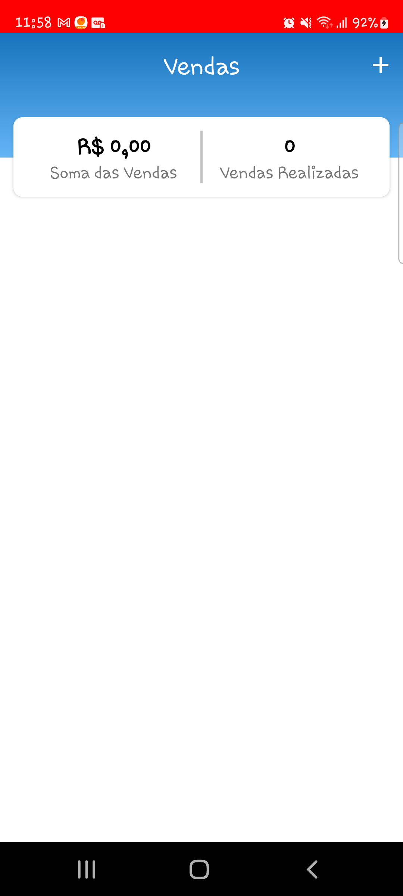
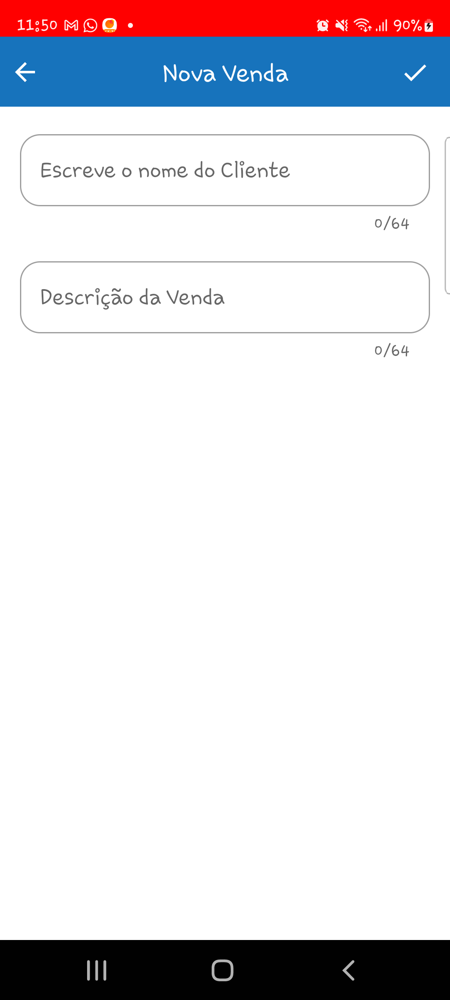
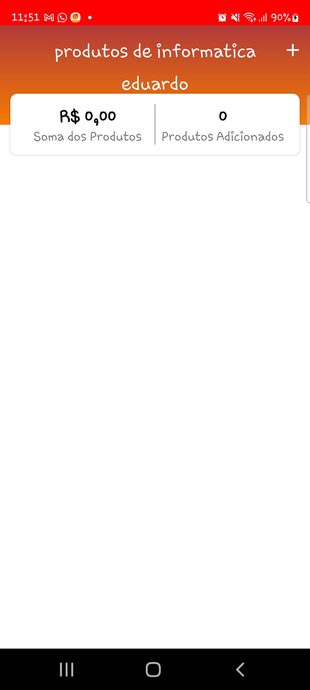
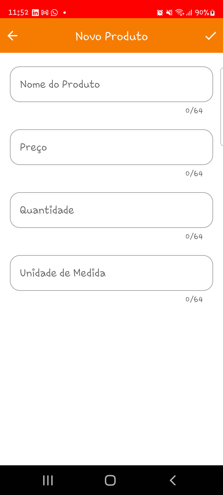
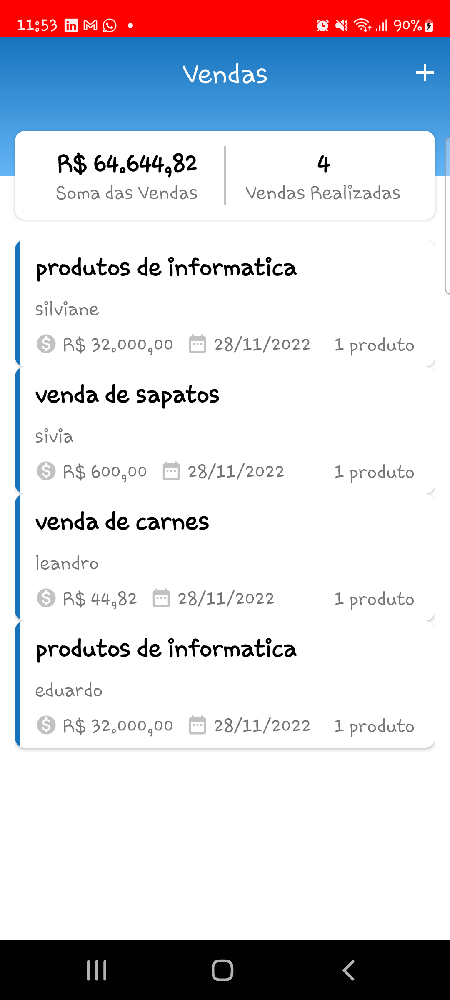

# VendasApp

## Synopsis
 Aplicação Android para Gerenciamento de Vendas

## Requerimentos

- Na tela de Vendas deve aparecer o nome do cliente
- O Usuário deve poder acrescentar o nome do cliente, do produto, a quantidade, o valor de cada unidade
- Na tela deve aparecer o valor total do item cadastrado com base na quantidade e no valor de cada unidade
- Na tela deve aparecer a quantidade total de itens
- Na tela deve aparecer o valor total do pedido

## Project development

 A primeira tela deste aplicativo é a tela de vendas. Esta tela informa o número de vendas realizadas, o total em R$ das vendas e nela é possivel adicionar uma nova venda.

 A segunda tela deste aplicativo surge quando se clica no botão "+" da primeira tela. Nela é possivel escrever o nome do Cliente e fazer uma descrição da Venda

 Ao dar o check na segunda tela o usuário é direcionado para a Tela de Detalhes da Venda. Nesta Tela é possivel ver o numero de produtos adicionados e o valor total de cada produto referente a esta venda

 Ao clicar no botão de "+" o usuário é direcionado para a Tela de Adição do Produto. Nesta Tela é possivel adicionar: O nome do produto, o preço, a quantidade de produtos e (caso possua) a unidade de médidas

 
 Ao dar o check o usuário é direcionado novamente para a tela de Detalhes da Venda com a atualização do cadastro que ele fez.

 Por fim ao clicar no botão voltar do celular o usuário volta a primeira tela (agora atualizada) e consegue ver os dados cadastrados da sua venda

## Frameworks and Bibliotecas
- **Livedata**
  As exibições escutam as respostas de processamento de imagem usando livedata. Sua vantagem é estar vinculado ao ciclo de vida da atividade e ter seu observador removido sempre que a atividade é encerrada.
- **Room** Biblioteca para Banco de Dados
- **Coroutines** Biblioteca Koltin para Trabalhar com funções assíncronas
- **Koin** Biblioteca para Injeção de Dependências
- **Navigation** Biblioteca para Navegação entre Fragments

## Arquitetura
- **Arquitetura MVVM** Arquitetura recomendada pelo Google
- **Clean Archtecture** Implementação de Camadas data, domain e presentation

## Melhorias
- Implementar Retrofit para Requisição com Web
- Implementar Testes unitários utilizando Roboeletric e Mockk
- Implementar possibilidade do usuário deletar o produto da venda 
- Implementar a possibilidade do usuário deletar a venda